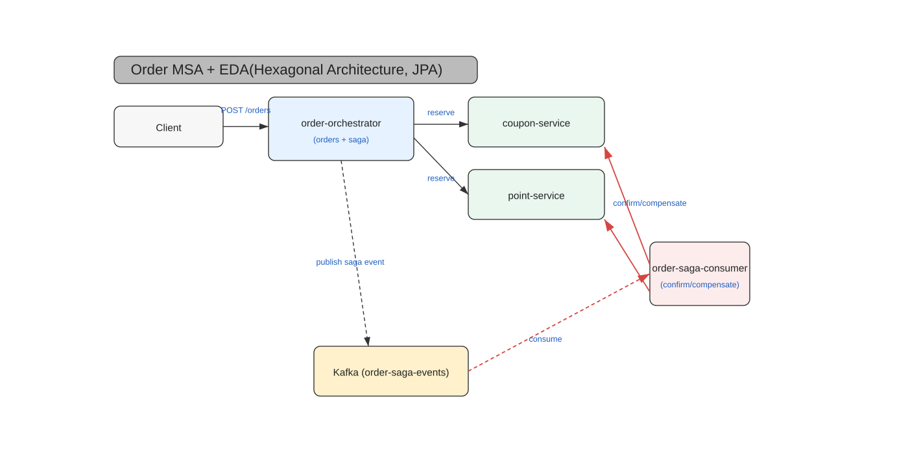

# Appendix A. 전체 시스템 아키텍처 다이어그램

## 1. 아키텍처 개요

이 프로젝트의 MSA(Microservice Architecture) 및 EDA(Event-Driven Architecture) 기반 주문 시스템은 Hexagonal Architecture 원칙을 따르며, Saga 패턴을 통해 분산 트랜잭션의 일관성을 보장합니다. 아래는 시스템의 주요 구성 요소와 상호작용을 시각적으로 표현한 아키텍처 다이어그램입니다.

## 2. 다이어그램 파일 위치

전체 시스템 아키텍처 다이어그램은 프로젝트 `docs` 폴더 내에 SVG 및 JPG 형식으로 저장되어 있습니다.

*   **SVG (Scalable Vector Graphics) 형식:** `docs/architecture_diagram.svg`
    *   벡터 기반 이미지로, 확대해도 깨지지 않으며 편집이 용이합니다.
    *   브라우저나 SVG 편집기(예: Inkscape, Adobe Illustrator)로 열어볼 수 있습니다.
*   **JPG (Joint Photographic Experts Group) 형식:** `docs/architecture_diagram.svg.jpg`
    *   일반적인 이미지 뷰어에서 쉽게 열어볼 수 있는 비트맵 이미지입니다.

## 3. 다이어그램 설명 (주요 구성 요소)

다이어그램을 통해 시스템의 다음과 같은 주요 구성 요소와 흐름을 파악할 수 있습니다.

*   **Order Orchestrator:**
    *   주문 생성 요청을 받아 Saga를 시작하고 조정하는 중앙 서비스입니다.
    *   `Coupon Service` 및 `Point Service`와 동기(HTTP) 호출을 통해 리소스(쿠폰, 포인트)를 예약합니다.
    *   Saga의 상태 변경 이벤트를 `Kafka`로 발행합니다.
*   **Coupon Service & Point Service:**
    *   독립적인 마이크로서비스로, 각각 쿠폰과 포인트 관련 비즈니스 로직을 처리합니다.
    *   `order-orchestrator`로부터 예약 요청을 받거나, `Order Saga Consumer`로부터 확정/보상 요청을 받습니다.
*   **Kafka:**
    *   이벤트 기반 아키텍처의 핵심 메시지 브로커입니다.
    *   `order-orchestrator`가 발행하는 `Order Saga Events`를 전파합니다.
*   **Order Saga Consumer:**
    *   `Kafka`에서 `Order Saga Events`를 구독합니다.
    *   Saga 상태에 따라 `Coupon Service` 및 `Point Service`에 확정(`confirm`) 또는 보상(`compensate`) 요청을 보냅니다.
    *   `Outbox Message` 테이블의 Saga 상태를 최종적으로 업데이트합니다.
*   **Database (MySQL):**
    *   각 서비스는 독립적인 데이터베이스(Database-per-service)를 가집니다.
    *   `order-orchestrator`는 `ORDER_SAGA` 테이블과 `OUTBOX_MESSAGE` 테이블을 관리합니다.
    *   `Coupon Service` 및 `Point Service`는 각각 `COUPON`, `POINT` 테이블 및 `COUPON_RESERVATION`, `POINT_RESERVATION` 테이블을 관리하여 멱등성과 타이밍 이슈를 해결합니다.
*   **Istio (Service Mesh):**
    *   MSA 간의 트래픽을 관리하고, 서킷 브레이커(Circuit Breaker)와 같은 복원력 정책을 적용합니다.
    *   애플리케이션 코드 변경 없이 네트워크 레벨에서 장애 격리 및 회복 기능을 제공합니다.
*   **Kubernetes:**
    *   전체 마이크로서비스 애플리케이션의 배포, 확장, 관리를 담당하는 컨테이너 오케스트레이션 플랫폼입니다.

---
다이어그램을 참고하여 시스템의 전체적인 구조를 머릿속에 그려보면, 각 챕터에서 다루는 내용들이 전체 시스템의 어떤 부분에 해당하며 어떻게 연결되는지 쉽게 이해할 수 있을 것입니다.